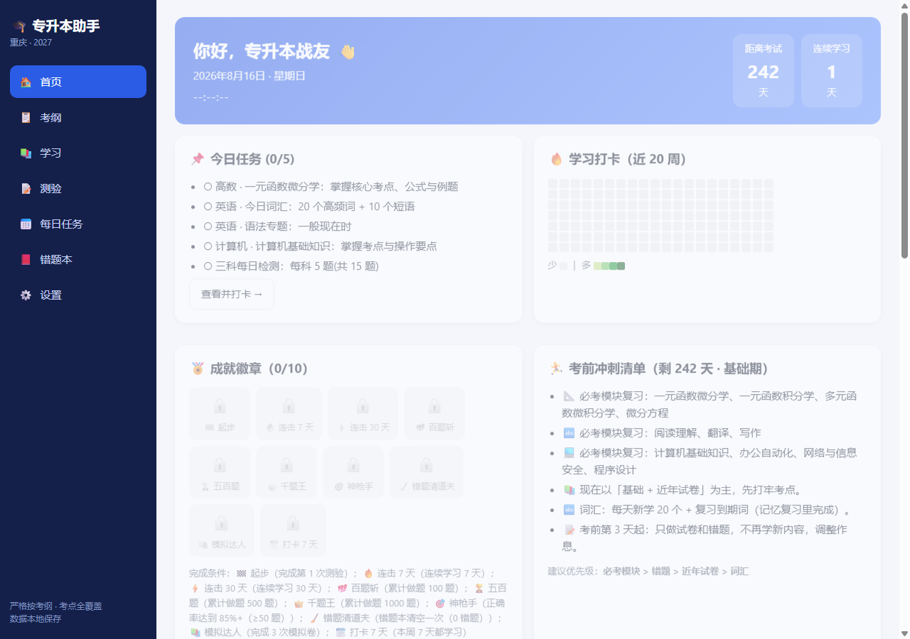
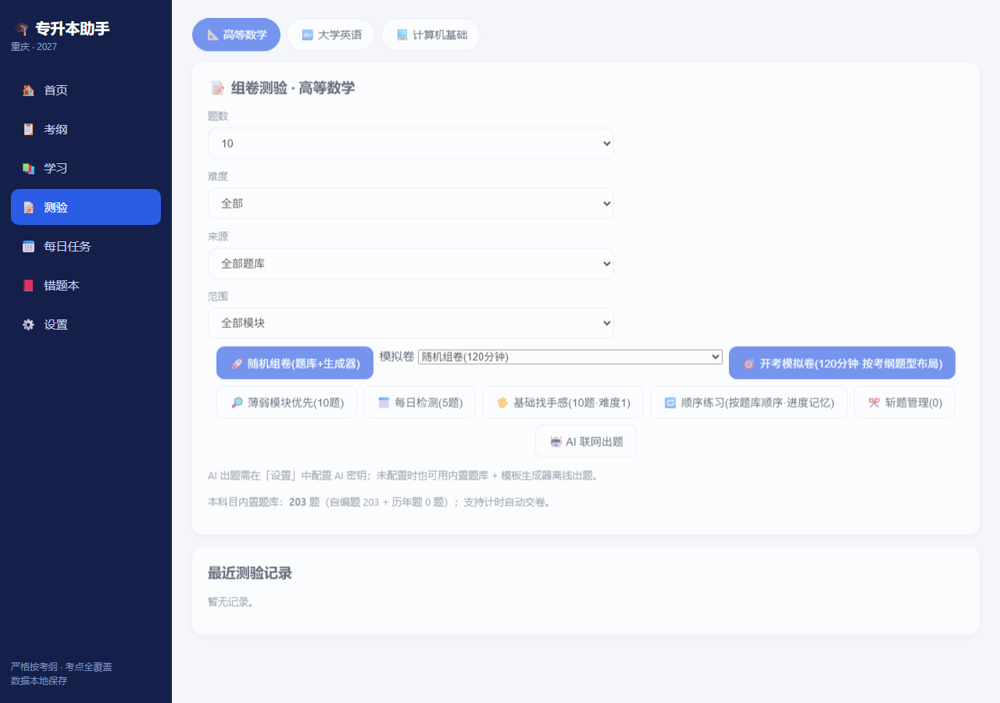
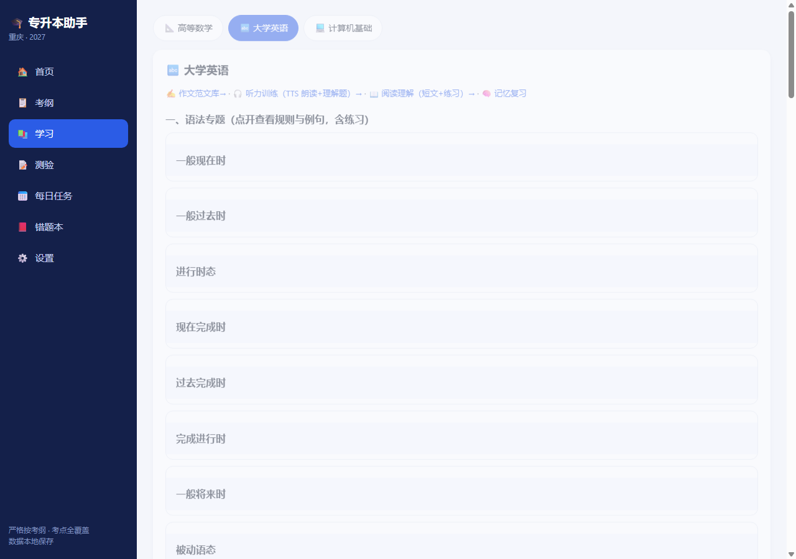

# Study Assistant for College Upgrade Exam (专升本学习助手)

<p align="center">
  <a href="https://wiexi220.github.io/weix/">
    
  </a>
  <a href="https://github.com/wiexi220/weix/blob/main/README.zh-CN.md">
    
  </a>
  
  
</p>

<p align="center">
  
</p>

<p align="center">
  
  
</p>

> 🎓 A **pure frontend, zero-dependency, double-click-to-run** study assistant for the College Upgrade Exam (专升本), covering **Advanced Math, College English and Computer Basics** — syllabus points, daily study tasks, timed quizzes, wrong-answer notebook, mock exams, and AI-powered explanations.

This repository is the **open-source framework (shell)** — all code, UI and self-authored sample materials are included. It does **NOT** include any copyrighted past exam papers (真题), which remain in the personal edition.

## 🚀 Live Demo

**https://wiexi220.github.io/weix/**

Open it in any browser on phone or desktop — no installation needed. Works offline via PWA.

## ✨ Features

| Module | Description |
|---|---|
| 📋 Syllabus | Exam syllabus for 3 subjects, module-based points, priority badges (must-know / frequent / rare) |
| 📚 Study | Module-by-module explanations + examples + practice; 22 English grammar topics, writing templates, AI essay grading |
| 📝 Quiz | Daily check / topic practice / mock exams (aligned with syllabus structure) / wrong-answer redo, built-in timer |
| 🔁 Sequential Practice | Study questions in bank order, **progress auto-saved** — resume where you left off |
| ✂️ Cut Questions | One-click "cut" questions you already know out of the normal practice pool; restore anytime |
| 🧠 Smart Review | Wrong answers auto-scheduled by forgetting curve (1/3/7/15/30 days); "Today Due" shown on dashboard |
| 🧩 Multi-Blank Fill | Fill-in-the-blank questions support multiple blanks answered separately |
| 🎲 Shuffled Options | Fixed A/B/C/D labels with shuffled content mapping (prevents memorizing option positions; can be disabled) |
| 🤖 AI Tutor | Optional: connect any OpenAI-compatible API for AI-generated questions, explanations and essay grading |
| 📅 Daily Tasks | Vocabulary memorization + math + English tasks with check-in and Pomodoro timer |
| 📕 Wrong Book | Auto-collects wrong answers, similar-question recommendations, mastery tracking |
| 📊 Reports | Study heatmap, monthly overview, weak-module radar chart, achievement badges |
| 📱 Multi-platform | Responsive: bottom bar on mobile, sidebar on desktop; data stored locally |

## 🧮 Code Statistics

| Category | Lines | Files |
|---|---|---|
| 🧠 Application code (JS) | 2,971 | 12 |
| 📚 Data content | 9,399 | 29 |
| 📄 HTML | 93 | 1 |
| 🎨 CSS | 298 | 1 |
| 🔧 Other (PWA manifest, service-worker) | 145 | 2 |
| **Total** | **12,906** | **45** |

## 🚀 Quick Start

**Option 1: Just open it** (no install)
Double-click `index.html` — everything works, data saved in your browser.

**Option 2: Local server**
```bash
python -m http.server 8080
# then visit http://localhost:8080
```

**Option 3: Online**
https://wiexi220.github.io/weix/

## 🧱 Project Structure

```
├── index.html            Page skeleton (single-page app)
├── js/                   Application code
│   ├── app.js            Main program (router / render / interactions)
│   ├── quiz.js           Quiz engine (build / grade / mock blueprint)
│   ├── generator.js      Question generator (offline unlimited) + bank aggregation
│   ├── ai.js             AI explanations / essay grading
│   ├── storage.js        localStorage persistence & backup
│   └── ...               Feature UI components
├── data/                 Data layer (all self-authored, no copyrighted content)
│   ├── syllabus.js       Exam syllabus
│   ├── math.js/english.js/computer.js   Subject materials
│   ├── easy-*.js         Basic practice questions
│   ├── listening*.js/reading*.js        Listening/reading materials
│   └── ...
├── assets/               Styles / KaTeX / icons / screenshots
├── manifest.webmanifest  PWA manifest
└── service-worker.js     Offline cache
```

## 🔌 Bring Your Own Question Bank

Question banks are plain JS objects — see `data/easy-math.js` for the simplest format:
```js
window.EASY_MATH_DATA = { questions: [{
  id: "ezm1", type: "single", module: "m1",
  stem: "The derivative of y = x³ is ( ).",
  options: ["3x²","x²","3x","2x²"],
  answer: "A",
  explain: "Power rule: (xⁿ)' = n·xⁿ⁻¹, so (x³)' = 3x².",
  difficulty: 1
}]};
```
Drop your file into `data/` and add `<script src="data/your-file.js">` to `index.html`.

**Multi-blank fill questions**: separate blank answers with `|` (e.g. `answer: "2|3"`) — the UI will render one input per blank.

## 🤖 AI Tutor (Optional)

In the Settings page, fill in your own API Key for any OpenAI-compatible endpoint (DeepSeek endpoint pre-filled). Offline features work without it.

## 📄 License

MIT License — free to use, modify and distribute.
Note: this repository does **NOT** include past exam papers; if you add copyrighted content, ensure you have the rights. Use at your own risk.

---

**Disclaimer**: This tool is for study assistance only. Always refer to the official syllabus published by the local education examination authority.
